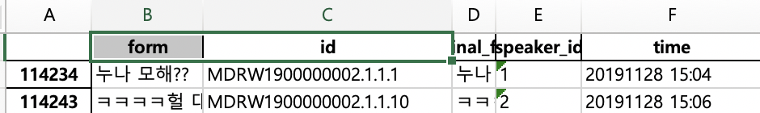

# parsing_json
## 모두의 말뭉치 파싱 코드 예시


- 모두의 말뭉치 다운로드 링크(승인 후 3회까지 다운로드 가능)

https://corpus.korean.go.kr/


- 메신저 말뭉치를 다운 받아서 파싱하는 코드   


```

import glob
import json
import pandas as pd

fn = glob.glob("*.json")
form = []
for fname in fn:
    jobj = json.load(open(fname, 'rt'))
    for doc in jobj['document']:
        for sentence in doc['utterance']:
            form.append(sentence)
            
#엑셀로 저장하면 엑셀이 제공하는 저장 공간을 넘기 때문에 뒤 부분에 내용이 잘린다
#pd.DataFrame(form).to_excel("messanger_result.xlsx")

pd.DataFrame(form).to_csv("messanger_result.csv")

```

```
 "id": "MDRW1900000002",
    "metadata": {
        "title": "국립국어원 메신저 말뭉치 MDRW1900000002",
        "creator": "국립국어원",
        "distributor": "국립국어원",
        "year": "2019",
        "category": "메신저 대화 > 2인 대화",
        "annotation_level": [
            "원시"
        ],
        "sampling": "참여자 모집 후 대화 수집"
    },
    "document": [
        {
            "id": "MDRW1900000002.1",
            "metadata": {
                "title": "메신저 대화",
                "author": "개인 대화 참여자",
                "publisher": "카카오톡",
                "date": "20191219",
                "topic": "여행 (여행지, 계획 등)",
                "speaker": [
                    {
                        "id": "1",
                        "age": "20대",
                        "occupation": "군인",
                        "sex": "남성",
                        "birthplace": "경기",
                        "pricipal_residence": "경기",
                        "current_residence": "경기",
                        "device": "스마트폰",
                        "keyboard": "2벌식(쿼티)"
                    },
                    {
                        "id": "2",
                        "age": "20대",
                        "occupation": "사무 종사자",
                        "sex": "여성",
                        "birthplace": "경기",
                        "pricipal_residence": "경기",
                        "current_residence": "경기",
                        "device": "PC",
                        "keyboard": "2벌식(쿼티)"
                    }
                ],
                "setting": {
                    "relation": "기타 : 온라인 커뮤니티",
                    "intimacy": 3,
                    "contact_frequency": "주 3회 이상"
                }
            },
            "utterance": [
                {
                    "id": "MDRW1900000002.1.1.1",
                    "form": "누나 모해??",
                    "original_form": "누나 모해??",
                    "speaker_id": "1",
                    "time": "20191128 15:04"
                },
```

- 결과 파일 이미지



